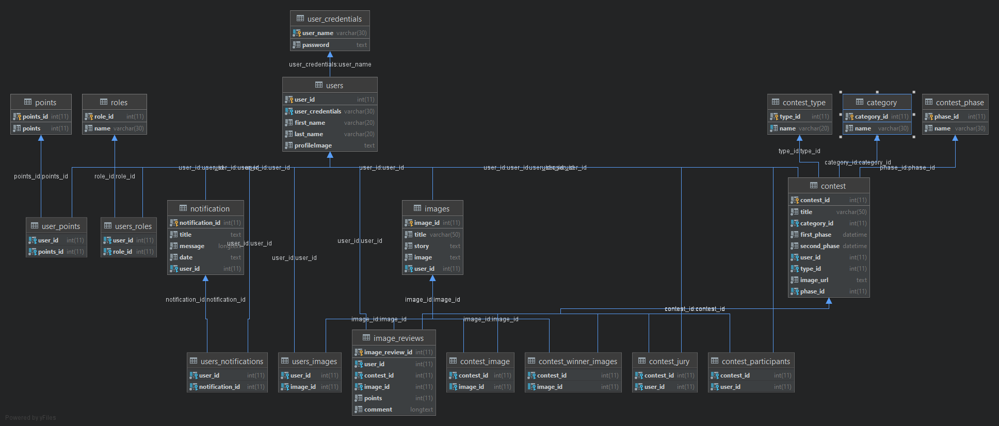

iPhoto Database relations:

Link to Trello board:
https://trello.com/b/pdC2sZtN/photo-contest

Link to Api Documentation
http://localhost:8080/swagger-ui.html#/

iPhoto is a platform powered by an amazing community that has uploaded hundreds of thousands
of their own photos to fuel creativity around the world. You can sign up for free.
Either way, you've got access to over a million photos under the iPhoto
license - which makes them free to do whatever you like with them.

BUILD AND RUN PROJECT STEPS
---
- 1 - Clone the repository.
- 2 - Create the Database with the existing SQL file (createDatabase.sql).
- 3 - Fill the Database with the existing SQL file (InsertInDatabase.sql).
- 4 - Build and run iPhoto project.
- 5 - Open the following link: http://localhost:8080/swagger-ui.html#/ or use another program to test the application.
- 6 - ENJOY!
---

---
                                                                 CATEGORIES
---

**NO AUTHORIZATION NEEDED**

**Get**
- Route - /api/categories

      All categories method

---

**ORGANIZER OPERATION**

**Get**

- Route -  /api/categories/categoryID

      Category by ID

---
          
---

**ORGANIZER OPERATION**

**Request Body**

**Post**

- Route -  /api/categories

      Create a new category
      Example:
      {
        "name": "Nature"
      }

---
                                                                 IMAGES
---

**AUTHORIZATION NEEDED**

**Get**
- Route - /api/images

      All images method

---

---

**AUTHORIZATION NEEDED**

**Post**

- Route -  /api/images/upload

      Uploads a new image

---
                                                                 USERS
---

**Organizer OPERATION**

**Get**
- Route - /api/users

      Returns all users

---

**AUTHORIZATION NEEDED**

**Get**

- Route -  /api/users/userID

      Returns user by ID

---

---

**AUTHORIZATION NEEDED**

**Get**

- Route -  /api/users/leaderboard

      Returns the current leaderboard in iPhoto

---

---

**AUTHORIZATION NEEDED**

**Get**

- Route -  /api/users/userID/profile

      Returns the profile of the user

---

---

**AUTHORIZATION NEEDED**

**Get**

- Route -  /api/users/userID

      Returns the user

---

---

**AUTHORIZATION NEEDED**

**Get**

- Route -  /api/users/userID/notifications

      Returns the notifications of the user

---

---

**AUTHORIZATION NEEDED**

**Get**

- Route -  /api/users/userID/contests

      Returns the contests in which the user participates in

---

---

**AUTHORIZATION NEEDED**

**Post**

- Route -  /api/users

      Creates a new user

---

---

**AUTHORIZATION NEEDED**

**Put**

- Route -  /api/users/userID

      Updates user

---

---
                                                                 CONTESTS
---

**AUTHORIZATION NEEDED**

**Get**
- Route - /api/contests

      Returns all users

---

---

**AUTHORIZATION NEEDED**

**Get**
- Route - /api/contests/contestID

      Returns contest by id

---

**ORGANIZER OPERATION**

**Get**
- Route - /api/contests/contestID/participants

      Returns the participants in contest

---

---

**AUTHORIZATION NEEDED**

**Get**
- Route - /api/contests/contestID/images

      Returns the images in contest

---

---

**ORGANIZER OPERATION**

**POST**
- Route - /api/contests

      Create a new contest

---

---

**ORGANIZER OPERATION**

**Put**
- Route - /api/contests

      Updates contest

---

---

**AUTHORIZATION NEEDED**

**Put**
- Route - /api/contests/contestID/user/userID

      Join user to contest

---

---

**AUTHORIZATION NEEDED**

**Post**
- Route - /api/contests/contestID/upload

      Uploads an image to contest

---

---

**AUTHORIZATION NEEDED**

**Put**
- Route - /api/contests/contestID/image/imageID

      Adds an image to contest
      Does not require multi-part

---

---

**AUTHORIZATION NEEDED**

**Put**
- Route - /api/contests/contestID/image/remove

      Removes an image from contest

---

---

**JURY OPERATION**

**Put**
- Route - /api/contests/contestID/image/rate

      Rates an image from contest

---

